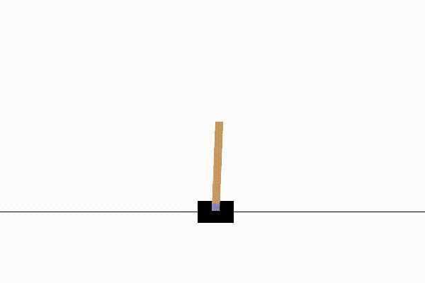

# NCjAx

Neural Cellular Automata as a universal computing substrate accelerated with JAX.

> [!NOTE]
> This takes lots of inspiration from the papers at the bottom of the readme, but also takes some liberties here and there. Assume nothing; expect everything.

## Usage

Following is a basic introduction to the NCjAx API. This should be enough to play around and get a feel for the substrate. For more advanced usage, import directly from core files.

### Initialization

```
from NCjAx import NCA, Config

# set up a config
# the only required fields are num_input_nodes and num_output_nodes
conf = Config(
    num_input_nodes=num_input,
    num_output_nodes=num_output,
    k_default=65,
    grid_size=16,
    hidden_channels=3,
    perception='learned3x3',
    hidden=30,
)

# set up our nice little helper
nca = NCA(conf)

key, init_key, pretrain_key = jax.random.split(key, 3)

# initialize parameters
params = nca.init_params(init_key)

# curriculum pretraining - helps to break out of local minima from the get-go
params, key, pretrain_accuracy = nca.pretrain(params, pretrain_key, steps=3000)
```

### Processing

The `process()` helper is just a shortcut to help you forward the substrate. It sends input, processes `K` ticks, and reads output. 


```
key, processing_key = jax.random.split(key)
output, next_state = nca.process(nca_state, nca_params, processing_key, input)
```

Note that although NCjAx is functionally pure, NCA is by nature stateful. Preserve the state and pass it back the next time around.

## Roadmap

If you feel like contributing, be my guest. Here's what's missing to align properly with the papers (and hopefully achieve some sort of learning ability beyond input->output mapping):

- [x] Fundamental NCA substrate
- [x] I/O tooling (sending data to, and receiving data from, the substrate)
- [x] Trainable convolutional filters to replace/extend identity+laplacian
- [x] "Fire rate" (stochastic per-cell dropout) as a stability measure
- [x] Pretraining helper (simple identity mapping to help escape local minima)
- [x] Trainable gain
- [x] Simple API interface
- [x] Solving CartPole!

## Results

This implementation of Neural Cellular Automata was used as the control policy in Cartpole-v1. It was trained using Double DQN with PER and a slight overflow penalty. To avoid clock hacking and statue-like behavior, a fire rate of 0.5 was used, in line with the fantastic paper (3). The reward system was *not* manipulated - we relied entirely on the standard cartpole reward scheme. No pool sampling was used. We used a grid size of 12x12, a fixed K=35 per environment step, 6 hidden channels and 20 learned filters. A compacted version of the training regimen can be found in [examples/nca_dqn.py](examples/nca_dqn.py). 



## But why?

NCA has some very interesting properties; the idea of a universal function approximator, capable of developing memory, self-regeneration and complex emergence is fantastic. It is extremely computationally demanding and requires lots of stabilizing tricks to solve something as simple as CartPole, thus cleary not a viable contender for any sort of practical use at the moment. 

So, why? Because of the *implications*. 

## The papers

This implementation takes a bit from each of the following very nice papers:

- (1): [A Path to Universal Neural Cellular Automata](https://arxiv.org/pdf/2505.13058)
- (2): [Growing Neural Cellular Automata](https://distill.pub/2020/growing-ca/)
- (3): [Towards self-organized control: Using neural cellular automata to robustly control a cart-pole agent](https://arxiv.org/abs/2106.15240)